<div align="center">



<br/>

<a href="https://github.com/LukiDevPro?tab=repositories"></a>
<a href="https://github.com/LukiDevPro?tab=followers"></a>


</div>

---

## About

Self-taught developer who mostly lives on the server side. I like systems that have to
stay up: game backends, bots, and the small tools that keep them running. When a project
needs a face, I'll build the frontend too — plain HTML, CSS and vanilla JS, no framework
unless it earns its place.

```text
focus     ·  game server backends, Discord bots, internal tooling
languages ·  Python, C#, JavaScript
learning  ·  cleaner architecture, async Python, saner deploys
ask me    ·  anything about running and debugging live game servers
schedule  ·  night owl — most commits land well after midnight
```

Most of my work sits in private repos, so the public side of this profile is
a lot quieter than the actual workload.

---

## Tech

**Languages**

<p>


</p>

**Tools**

<p>


</p>

---

## Public work

<table>
<tr>
<td width="50%" valign="top">

### [Null's Magic Color](https://github.com/LukiDevPro/Nulls-Magic-Color)

A tiny browser tool that runs any text through a 3-stop color gradient and hands
back the ready-to-paste `<cRRGGBB>` markup. Live preview, custom color pickers,
one-click copy.

`HTML` · `Vanilla JS` · no build step

</td>
<td width="50%" valign="top">

### [magicbrawl.gg](https://github.com/LukiDevPro/magicbrawl.gg)

Static landing page for a private game server — responsive layout, EN/RU language
switch, download flow and an install walkthrough. Hand-written CSS, no framework.

`HTML` · `CSS` · `JS`

</td>
</tr>
</table>

> The rest — game server backends, Discord bots and tooling — is private.

---

## Stats

<div align="center">


<br/><br/>


</div>

---

## Connect

<div align="center">

<a href="https://github.com/LukiDevPro"></a>

<br/><br/>

<sub>Thanks for stopping by — issues and PRs on the public repos are always welcome.</sub>

</div>
